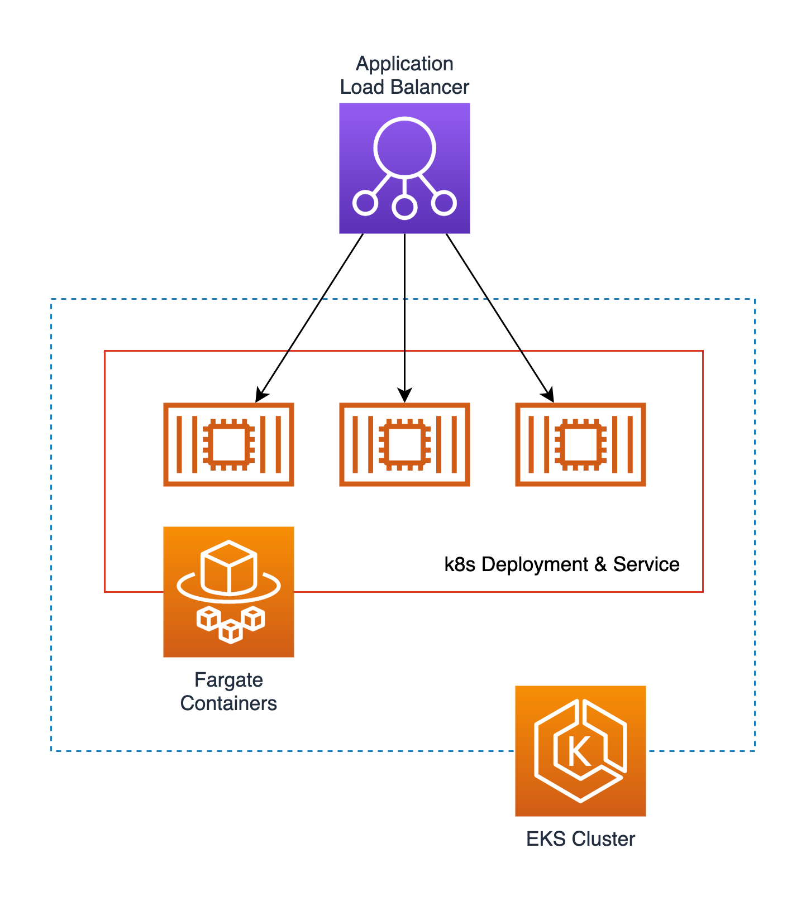

# Terraform AWS EKS ALB Architecture Pattern

Terraform implementation of a commonly-used AWS architecture pattern of deploying a load-balanced Kubernetes service to an EKS cluster.

- Kubernetes version is 1.20.
- Cluster type is fargate. No EC2 nodes used at all.
- The Helm provider is included & pre-configured. You can use it to install Helm charts.

This repo is intended to be a reference and a quick start to show how to create an EKS cluster in Terraform and deploy a load-balanced service to it. As an example, this repo deploys 3 Nginx containers behind an ALB. When you adopt this set of templates for your app, simply modify the `nginx.tf` file with your container.
